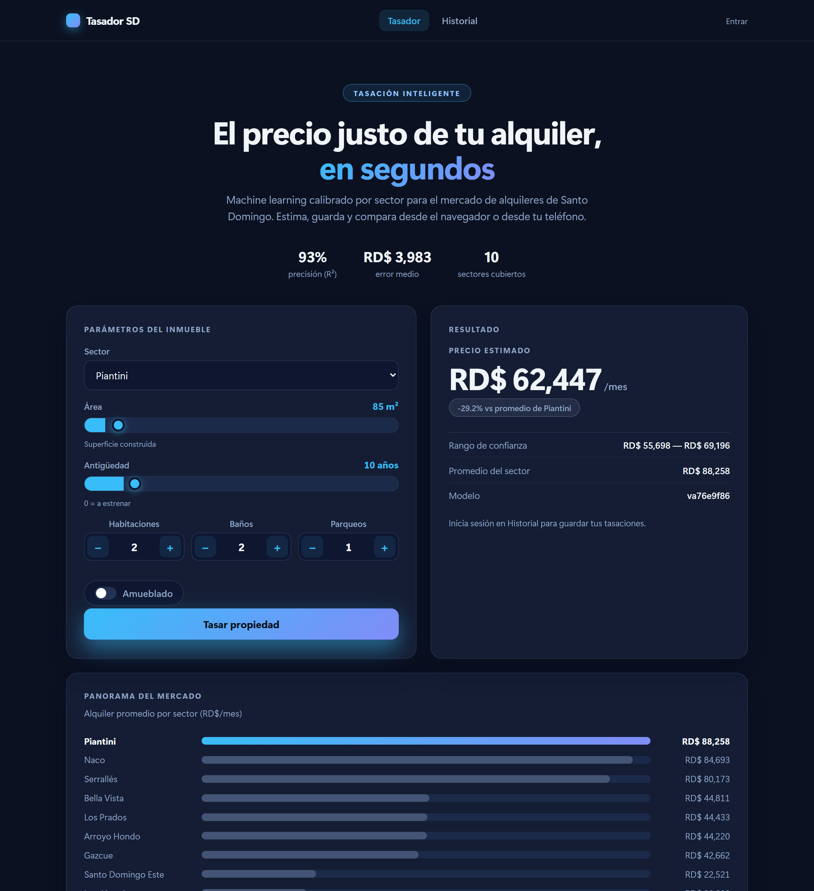
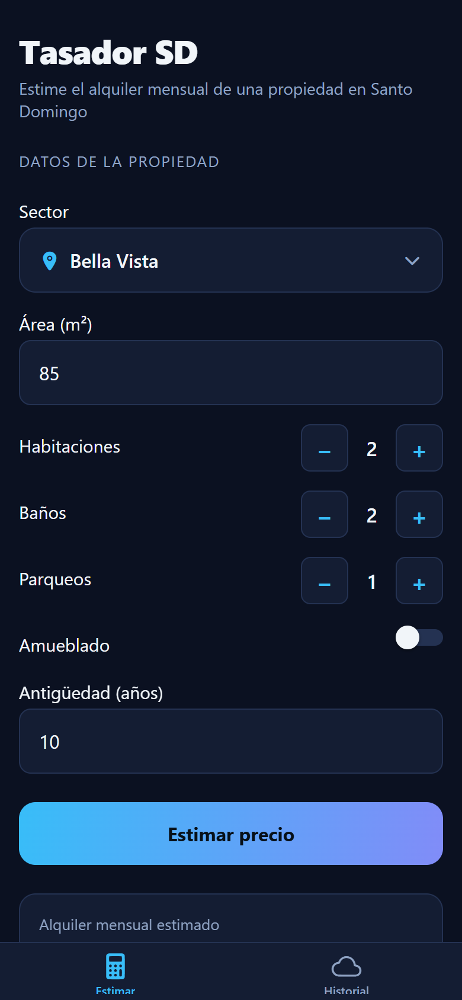
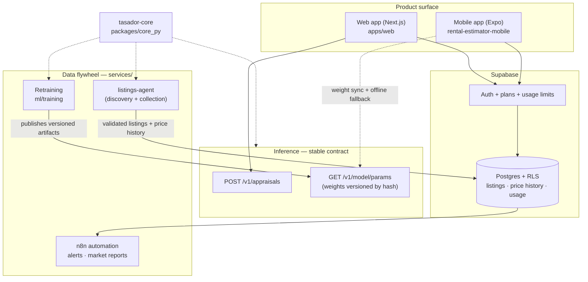

# Tasador SD

[](https://github.com/Criscarr26/tasador-sd/actions/workflows/ci.yml)

**Instant, data-driven rental appraisals for Santo Domingo — a commercial
SaaS for real-estate agencies, landlords and proptech partners.**

**Product:** [tasadorsd.vercel.app](https://tasadorsd.vercel.app) · **API:** [tasador-sd.vercel.app/health](https://tasador-sd.vercel.app/health)

| Web (Next.js) | Mobile (Expo) |
|:---:|:---:|
|  |  |

---

## The problem

In Santo Domingo there is no objective reference for rental prices.
Landlords list blind, tenants negotiate without data, and agencies price
by intuition. The cost is real: mispriced units sit empty for weeks, and
agents lose credibility quoting numbers they cannot defend.

## The solution

Tasador SD answers, in seconds, **what a property's monthly rent should
be** — from its sector, size and features — with a confidence range and a
comparison against the sector average. One machine-learning model, served
through a stable API, powers two synchronized product surfaces (a
commercial web app and a field-work mobile app), fed by an autonomous
agent that collects real market listings to keep the model honest.

## Who it is for

| Audience | What they get | How they pay |
|---|---|---|
| **Real-estate agencies** (primary) | Defensible pricing + per-sector market reports | Monthly report / Agency plan |
| **Independent agents & landlords** | Instant appraisals, saved history | Freemium → Pro |
| **Proptech / portals (partners)** | Appraisal API to embed in their own product | API plan (future) |

## Value proposition

- **A number you can defend** — every appraisal ships with its confidence
  range and the sector average, not a bare figure.
- **The only rental price-history index for Santo Domingo** — the data
  flywheel snapshots every listing price change, building an asset no
  competitor has (see the [scalability roadmap](docs/SCALABILITY-ROADMAP.md)).
- **Works where agents work** — web at the desk, mobile in the field,
  offline-capable, the same model everywhere.

## Product status (honest)

This is a **working product in the market-validation stage**, not a
prototype: web and API are deployed and live, auth and usage plans run in
the database, and security (RLS, rate limiting, CSP) is in production. The
model today is trained on 500 market-calibrated **synthetic** rows — the
real-data engine is built and in activation (see the roadmap). The product
states this transparently to users.

| Component | Status |
|---|---|
| Commercial web app (`apps/web`) | ✅ Live |
| Inference API (`api/` serverless + `apps/api` container) | ✅ Live, versioned model |
| Domain core + parity contract (`packages/core_py`) | ✅ Enforced in CI |
| Plans & usage limits (Supabase) | ✅ In database, enforced by triggers |
| Mobile app (Expo, separate repo) | ✅ Working demo |
| Data flywheel (`services/`) | ⚙️ Built, in activation |
| Real-data model retrain | ⚙️ Next milestone |

## Differentiators

**Technical**
- **One definition of the model.** `tasador-core` owns the domain
  (features, sectors, validation ranges, pipeline and weight export).
  Every client that predicts on-device must reproduce the reference
  predictions exactly — enforced by a parity test in CI. This kills the
  entire class of "web says X, app says Y" bugs.
- **Model versioned by content hash** — retraining changes the version and
  every client detects it with no manual step and no app rebuild.
- **Security in production, not aspirational** — Row Level Security on
  every table, per-IP rate limiting, CSP with a per-request nonce.

**Operational**
- **A data moat that compounds** — price-trajectory snapshots turn usage
  into a proprietary market index over time.
- **Free-tier operation** — the entire stack runs at ~US$0/month until
  paying volume justifies upgrades (see [infra/README.md](infra/README.md)).

---

## Repository map

The repo is organized as a product, not a bag of demos. Full rationale in
[docs/PRODUCTION-STRUCTURE.md](docs/PRODUCTION-STRUCTURE.md).

```
apps/web/          Commercial product — the customer-facing surface (Next.js)
apps/api/          Inference engine (container build) — stable public contract
api/               Same contract, serverless build (deployed on Vercel)
packages/core_py/  tasador-core — single source of truth for the domain/model
services/          Automation & data flywheel (see services/README.md)
  listings-agent/    autonomous real-listing collector (Anthropic tool use)
  n8n/               product automation: bargain alerts, market reports
ml/training/       Reproducible training; emits versioned model artifacts
supabase/migrations/  Formal database history (RLS, plans, price history)
infra/             Deployment, CI/CD and operations (see infra/README.md)
docs/              Architecture, monetization and growth documentation
```

**The demo vs. the product.** The Streamlit estimator
([rental-price-estimator-sd](https://github.com/Criscarr26/rental-price-estimator-sd))
remains as **portfolio evidence** of the modeling work — it is *not* the
product. The product is `apps/web`, backed by the API and the data
flywheel. One customer-facing surface, one value path. The mobile app
lives in its own repo:
[rental-estimator-mobile](https://github.com/Criscarr26/rental-estimator-mobile).

## Architecture



The design rule that holds everything together: **the model has exactly
one definition**. `tasador-core` owns the schema, sectors, validation
ranges and pipeline; training exports plain weights with embedded
reference predictions; every client that predicts on-device must reproduce
those references exactly (enforced by tests in CI).

## Business model

Freemium is already implemented at the database level (plans and monthly
usage limits enforced by Postgres triggers — no client can bypass them).
First revenue does **not** require a payment gateway: monthly per-sector
market reports to agencies, billed by transfer. Full plan in
[docs/MONETIZATION-PLAN.md](docs/MONETIZATION-PLAN.md).

- **Free** — limited appraisals/month, personal history. Acquisition.
- **Pro** — higher volume, longer history, per-sector reports.
- **Agency** — multiple users, market dashboards, premium reports, SLA.
- **Partner API** — appraisal API for portals/integrators (expansion).

## Documentation

| Doc | What it covers |
|---|---|
| [PRODUCTION-STRUCTURE.md](docs/PRODUCTION-STRUCTURE.md) | How the repo is organized as a product |
| [MONETIZATION-PLAN.md](docs/MONETIZATION-PLAN.md) | Plans, usage control, reports, partner API |
| [SCALABILITY-ROADMAP.md](docs/SCALABILITY-ROADMAP.md) | MVP → operation → monetization → multi-tenant → flywheel |
| [DEPLOY.md](docs/DEPLOY.md) | Step-by-step deployment (all free tiers) |
| [infra/README.md](infra/README.md) | Deployment topology, environments, operations |
| [infra/ci-cd/README.md](infra/ci-cd/README.md) | CI/CD pipeline and quality gates |
| [services/README.md](services/README.md) | The automation & data-flywheel layer |
| [SECURITY.md](SECURITY.md) | Security model and disclosure process |

## Quality gates (CI)

- `packages/core_py/tests` — domain validation + the parity contract:
  exported weights must reproduce the sklearn pipeline exactly.
- `apps/api/tests` — the API's appraisals must equal the exported
  reference predictions; invalid input is rejected with shared messages.
- root `tests/` — serverless parity + discovery-filter contract.
- `apps/web` — production build on every push.

Verified end-to-end against live services: sign in, appraise
(RD$ 83,862 on the Piantini reference case), automatic history save,
shared history across web and mobile.

## Development

```bash
# API (container build) — venv with apps/api/requirements.txt + tasador-core
cd apps/api && uvicorn main:app --port 8000

# Web
cd apps/web && npm install && npm run dev   # http://localhost:3000

# Core contract tests
cd packages/core_py && python -m unittest discover tests -v

# Data-collection service, offline end-to-end
cd services/listings-agent && python agent.py --dry-run
```

Copy `apps/web/.env.local.example` to `.env.local` (Supabase keys are
optional: without them the appraiser works and only the history is
disabled).

## License

[MIT](LICENSE)
