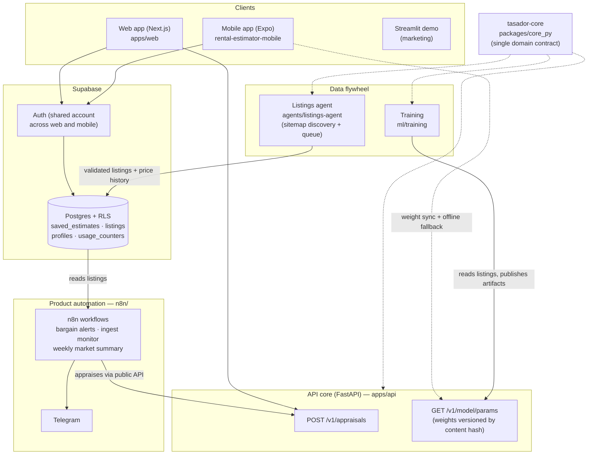

# Tasador SD

[](https://github.com/Criscarr26/tasador-sd/actions/workflows/ci.yml)

**Live demo:** [tasadorsd.vercel.app](https://tasadorsd.vercel.app) · **API:** [tasador-sd.vercel.app/health](https://tasador-sd.vercel.app/health)

Rental price appraisal platform for Santo Domingo, Dominican Republic.
One machine-learning model, one domain contract, three synchronized
clients: a commercial web app, a mobile app and a public demo — plus an
autonomous agent that collects real market data to retrain the model.

| Web (Next.js) | Mobile (Expo) |
|:---:|:---:|
|  |  |

## Architecture



The design rule that holds everything together: **the model has exactly
one definition**. `tasador-core` owns the schema, sectors, validation
ranges and pipeline; training exports plain weights with embedded
reference predictions; every client that predicts on-device must
reproduce those references exactly (enforced by tests in CI).

## Monorepo layout

```
packages/core_py/     tasador-core: domain schema, validation, model helpers
ml/training/          training pipeline; emits .pkl, metrics and exported weights
apps/api/             FastAPI inference core (single source of inference)
apps/web/             commercial web app (Next.js 16, shared design tokens)
agents/listings-agent/ autonomous data-collection agent (Anthropic tool use)
supabase/migrations/  formal database history (RLS, listings, plans/usage)
n8n/                  automation layer: bargain alerts, ingest monitor, weekly summary
docs/                 deployment guide and assets
```

The mobile app lives in its own repo as a standalone demo:
[rental-estimator-mobile](https://github.com/Criscarr26/rental-estimator-mobile).

## Quality gates

- `packages/core_py/tests` — domain validation + the parity contract:
  exported weights must reproduce the sklearn pipeline exactly.
- `apps/api/tests` — the API's appraisals must equal the exported
  reference predictions; invalid input is rejected with shared messages.
- `apps/web` — production build on every push.
- Verified end-to-end against live services: sign in, appraise
  (RD$ 83,862 on the Piantini reference case), automatic history save,
  shared history across web and mobile.

## Getting started (development)

```bash
# API (needs a venv with apps/api/requirements.txt + tasador-core)
cd apps/api && uvicorn main:app --port 8000

# Web
cd apps/web && npm install && npm run dev   # http://localhost:3000

# Core tests
cd packages/core_py && python -m unittest discover tests -v

# Agent, offline end-to-end
cd agents/listings-agent && python agent.py --dry-run
```

Copy `apps/web/.env.local.example` to `.env.local` (Supabase keys are
optional: without them the appraiser works and only the history is
disabled).

## Deployment

Free-tier deployment for every piece (Supabase + Hugging Face Spaces +
Vercel): see [docs/DEPLOY.md](docs/DEPLOY.md).

## Business model (designed, not yet charged)

Plans live in the database (`profiles.plan`) with monthly usage limits
enforced by triggers — no client can bypass them. Free: 100 appraisals
per month; Pro/Agency: unlimited, reserved for payment integration.

## License

[MIT](LICENSE)
